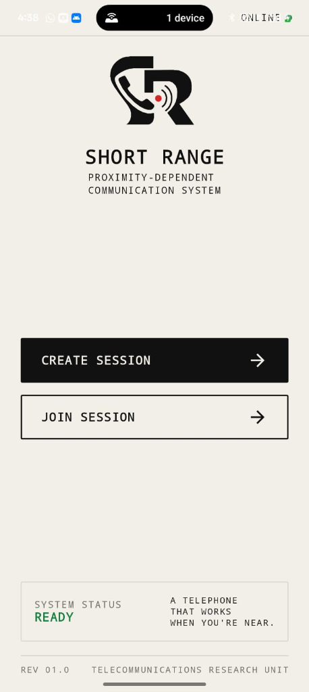
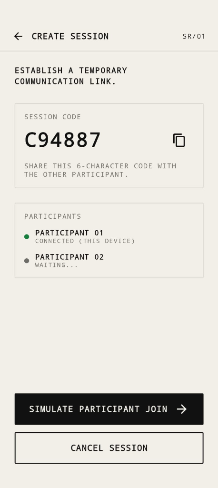
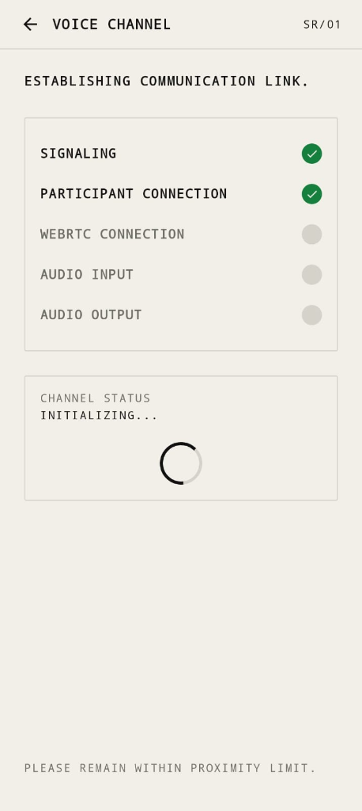
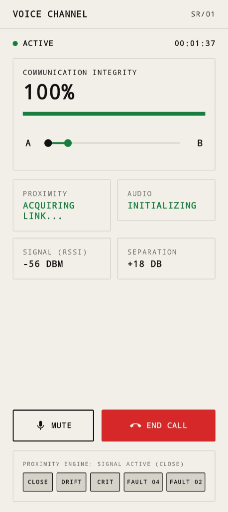
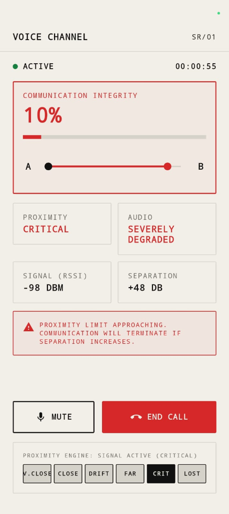
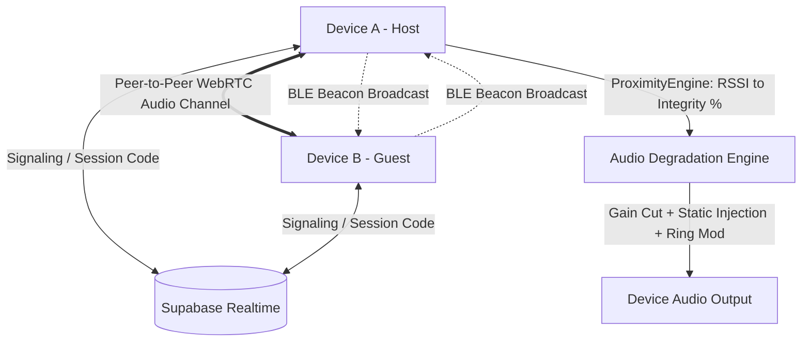

# SHORT RANGE (SR/01) 🎯


## Basic Details
### Team Name: Ctrl+C


### Team Members
- Team Lead: Mishal K - School of Engineering, CUSAT
- Member 2: Mohammad Afsal M - School of Engineering, CUSAT

### Project Description
SHORT RANGE is an intentionally distance-limited voice communication system. It is a full-duplex WebRTC voice calling mobile app that functions only when two callers are physically close to each other — moving further apart dynamically degrades audio quality into noise and distortion until the connection is terminated.

### The Problem (that doesn't exist)
Modern telecommunications have become excessively reliable. Global cellular networks and satellites allow people to converse effortlessly across oceans and continents, completely ruining the thrill of having to stand awkwardly within arm's reach of someone just to talk to them on a high-tech smartphone.

### The Solution (that nobody asked for)
A voice call application engineered with inverse utility: callers must stand right next to each other to experience clear audio. Using real-time Bluetooth Low Energy (BLE) RSSI telemetry, the app continuously calculates physical proximity, dynamically degrading WebRTC voice into analog static, aggressive bitcrushing, and robotic distortion as separation increases — dropping the channel completely if callers drift too far.

## Technical Details
### Technologies/Components Used
For Software:
- Languages used: Kotlin
- Frameworks used: Jetpack Compose, Android SDK (API 26+)
- Libraries used: Google WebRTC Android SDK, Supabase Kotlin SDK (Realtime & PostgREST), Kotlinx Coroutines, Kotlinx Serialization
- Tools used: Android Studio, Gradle, ADB, Git

For Hardware:
- List main components: 2x Android Smartphones with BLE peripheral and central support
- List specifications: Bluetooth 5.0+ LE, Wi-Fi or Cellular data connection, Full-duplex microphone & loudspeaker/earpiece
- List tools required: USB-C data cables, physical test area (1-10 meters)

### Implementation
For Software:
# Installation
```bash
# Clone the repository
git clone https://github.com/Mishalr7/short-range-useless-project.git
cd short-range-useless-project

# Build the debug APK
./gradlew assembleDebug
```

# Run
```bash
# Install on connected Android devices
adb -s <DEVICE_ID_1> install -r app/build/outputs/apk/debug/app-debug.apk
adb -s <DEVICE_ID_2> install -r app/build/outputs/apk/debug/app-debug.apk

# Launch the application
adb shell am start -n com.shortrange.app/.MainActivity
```

### Project Documentation
For Software:

# Screenshots (Add at least 3)

*Home Screen: Industrial interface displaying system readiness and options to establish or join a voice channel.*


*Create Session: Generates a unique 6-character session code and awaits peer connection.*


*Channel Link Initialization: Real-time Supabase signaling verification and WebRTC peer negotiation checklist.*


*Active Channel (Optimal Proximity): 100% communication integrity with crystal-clear audio at close range (-56 dBm).*


*Boundary Separation (Critical): Proximity limit approaching, RSSI drops to -98 dBm, audio severely degraded with alert warnings.*

# Diagrams

*Workflow & Architecture: Dual-channel architecture combining cloud signaling via Supabase, peer-to-peer WebRTC voice streaming, and hardware BLE RSSI distance sensing to dynamically modulate audio degradation.*

For Hardware:

# Schematic & Circuit
*N/A — Pure software application utilizing onboard smartphone BLE transceivers and audio codecs.*

# Build Photos
*N/A — Pure software application deployed on standard Android commercial hardware.*

### Project Demo
# Video
[Add your demo video link here]
*Demonstrates two smartphones establishing a WebRTC call, walking apart with real-time audio degradation, and recovering when walking back together.*

# Additional Demos
[Add any extra demo materials/links]

## Team Contributions
- Mishal K: Android project architecture, WebRTC voice pipeline, BLE proximity detection, audio degradation engine, and dual-device calibration.
- Mohammad Afsal M: Supabase Realtime signaling, UI/UX implementation, session synchronization, testing protocols, and demo coordination.

---
Made with ❤️ at TinkerHub Useless Projects 


